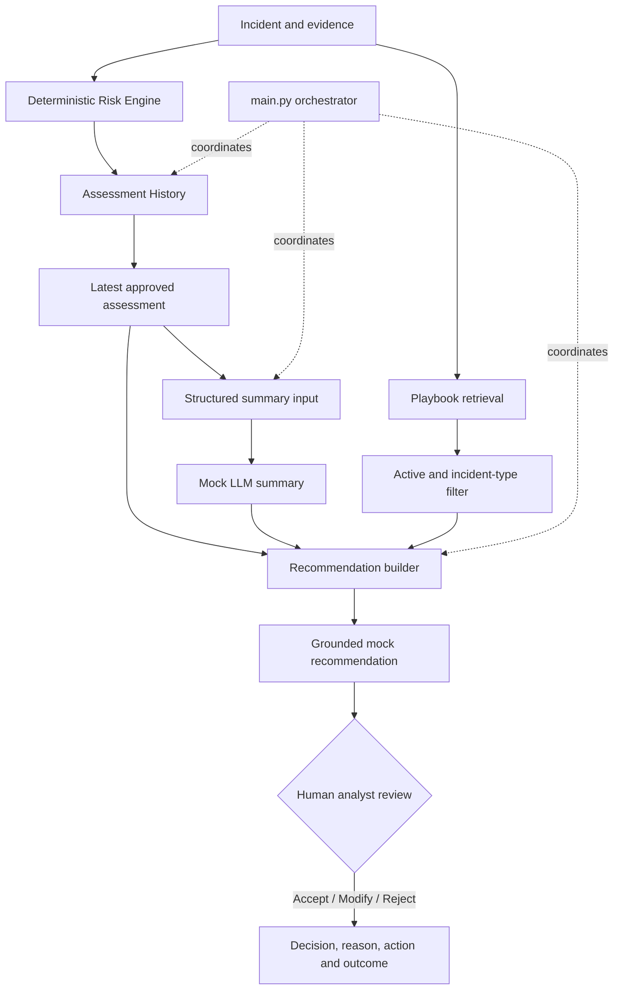

# SOC Copilot V1

A modular, auditable prototype that helps Security Operations Center (SOC) analysts assess incidents, review policy-grounded recommendations and record human decisions without delegating high-impact containment to an LLM.

## Problem

SOC analysts must combine noisy evidence, severity rules and response playbooks under time pressure. A generic chatbot can summarize text, but it is a poor source of truth for deterministic risk scores and unsafe when it can trigger containment without traceability or approval.

SOC Copilot V1 demonstrates a safer product boundary:

- code calculates security facts;
- an assessment layer preserves what was known at decision time;
- a mock LLM explains approved facts rather than redefining them;
- retrieval supplies only active, incident-relevant playbook content;
- recommendations cite their source chunks;
- a human analyst accepts, modifies or rejects the recommendation.

## Users

- **L1/L2 SOC analysts** reviewing suspicious-login and malware alerts.
- **SOC managers** evaluating consistency, override patterns and outcomes.
- **Security engineering and audit stakeholders** reviewing ruleset provenance, evidence snapshots and policy use.

## Architecture



The external product interface is `run_soc_copilot(incident)`. Each component can evolve independently while the orchestration contract stays stable.

## V1 Features

- Deterministic routing and scoring for `Suspicious Login` and `Malware Detection`.
- Versioned score output with base and final severity.
- Point-in-time evidence snapshots using deep copies.
- Append-only assessment history for initial and updated evidence.
- Structured summary context and mock LLM output.
- Active-policy and incident-type retrieval with retired-policy exclusion.
- Policy-grounded recommendations with `supported_by` chunk IDs.
- Mandatory human review before containment.
- Analyst `Accept`, `Modify` and `Reject` feedback; reasons are required for modifications and rejections.
- One orchestration layer and a dependency-free regression suite.

## Preserved scoring behavior

V1 intentionally freezes the validated ruleset at `v0.1`.

| Incident | Factor | Points |
| --- | --- | ---: |
| Suspicious Login | Impossible travel | 30 |
| Suspicious Login | Suspicious IP | 25 |
| Suspicious Login | Outside working hours | 10 |
| Malware Detection | Malicious file reputation | 30 |
| Malware Detection | Persistence | 30 |
| Malware Detection | Suspicious network activity | 20 |

Severity thresholds are `Low` below 30, `Medium` from 30–59, `High` from 60–79 and `Critical` from 80. A privileged user is elevated to `High` only when the calculated severity would otherwise be `Low` or `Medium`.

## Safety and human-in-the-loop design

- **Deterministic source of truth:** the mock LLM explains the latest approved assessment; it cannot change risk score or severity.
- **Event-time correctness:** each assessment stores its timestamp, ruleset version and deep-copied evidence snapshot.
- **Policy control:** retired and incident-irrelevant chunks are excluded before recommendation construction.
- **Provenance:** every recommendation returns the supporting chunk IDs.
- **No autonomous containment:** `human_review_required` remains `true` and the analyst owns the final action.
- **Learning without rewriting history:** feedback and outcome are stored separately from the original risk assessment.

## Quick start

Requirements: Python 3.10 or newer. No third-party packages are required.

```bash
git clone <https://github.com/carlsonloo/SOC-COPILOT-V1.git>
cd soc_copilot_v1
python -m pip install -r requirements.txt
python tests.py
python demo.py
```

`tests.py` should finish with `End-to-end Copilot test: PASS`. `demo.py` prints the complete assessment, summary, recommendation and analyst-feedback flow as JSON.

For a five-minute walkthrough, use [docs/DEMO.md](docs/DEMO.md).

## Tests

The regression suite verifies:

| Area | Expected behavior |
| --- | --- |
| Risk scoring | `65 / High`, `60 / High`, `80 / Critical` across three cases |
| Assessment history | Initial `40 / Medium` and updated `65 / High` both remain available |
| Snapshot integrity | New evidence does not mutate the earlier snapshot |
| Summary | Uses the latest assessment and preserves score/severity facts |
| Retrieval | Returns `SL-001`, `SL-002`; excludes `SL-OLD`, `MW-001` |
| Recommendation | Cites both active policy chunks and requires human review |
| Feedback | Records a modified recommendation, reason and contained outcome |
| Orchestration | Returns risk assessment, summary and recommendation in one response |

Run all tests with:

```bash
python tests.py
```

## Project structure

```text
soc_copilot_v1/
├── main.py                 # Stable orchestration interface
├── risk_engine.py          # Deterministic scoring and severity
├── assessment.py           # Audit metadata and assessment history
├── summary.py              # Structured context and mock LLM summary
├── retrieval.py            # Mock playbook knowledge base and filtering
├── recommendation.py       # Grounded recommendation construction
├── feedback.py             # Human decisions, actions and outcomes
├── data.py                 # In-memory demo and test fixtures
├── demo.py                 # End-to-end portfolio demonstration
├── tests.py                # Dependency-free regression suite
├── docs/
│   └── DEMO.md             # Five-minute interview walkthrough
├── requirements.txt
├── .gitignore
└── README.md
```

## Honest scope and limitations

This is an architecture-first prototype, not a production SOC platform:

- `mock_llm_summary` and `mock_recommendation` are deterministic placeholders.
- Retrieval is metadata filtering, not embedding, hybrid search or reranking.
- Data, audit history and feedback are in memory and are not durable.
- There is no API, UI, identity layer, authorization model, observability or production evaluation pipeline.
- The recommendation text currently models the suspicious-login workflow; malware recommendation generation is a future extension.

These constraints are intentional in V1: they keep model variability outside the system until deterministic behavior, safety boundaries and component contracts are testable.

## Roadmap

### V1.1 — Real model integration

- Replace mock summary generation with structured LLM output.
- Add prompt and model versioning, schema validation, timeouts and fallback behavior.
- Build golden-dataset checks for factual consistency and unsupported claims.

### V2 — Enterprise retrieval

- Move playbooks into a versioned document store.
- Apply authorization and metadata filtering before retrieval.
- Add keyword + semantic hybrid retrieval, top-k selection and reranking.
- Measure retrieval recall, citation correctness and answer groundedness.

### V3 — Operational agent controls

- Add identity-aware APIs and durable audit storage.
- Separate reasoning from tool execution.
- Require deterministic guardrails and approval for high-impact actions.
- Add idempotency, retry controls, observability and outcome-based evaluation.

## Interview talking points

1. **Why not let the LLM score risk?** Security rules must be reproducible, testable and auditable; the LLM communicates facts but does not own them.
2. **Why preserve multiple assessments?** Analysts need to know what the system knew at each point in time, especially when new evidence changes severity.
3. **What makes the recommendation grounded?** Only active, incident-relevant chunks enter context, and their IDs are returned as provenance.
4. **Where is the human control?** The system recommends; the analyst owns containment and records accept/modify/reject feedback.
5. **How would this become enterprise-ready?** Add authorization-aware hybrid retrieval, structured model outputs, durable audit logs, evaluation, guardrails and idempotent tool execution without changing the external orchestration contract.

## Key design statement

> I designed a modular SOC Copilot where deterministic risk scoring, point-in-time audit history, generative explanation, policy retrieval, grounded recommendations and analyst feedback are separated into independently testable components and coordinated through a stable orchestration layer.
